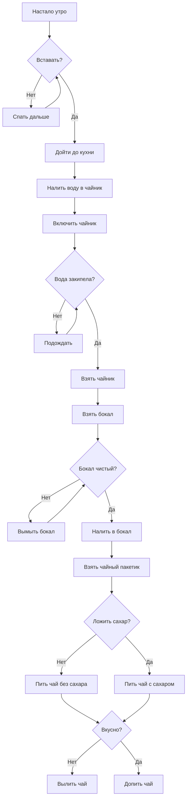
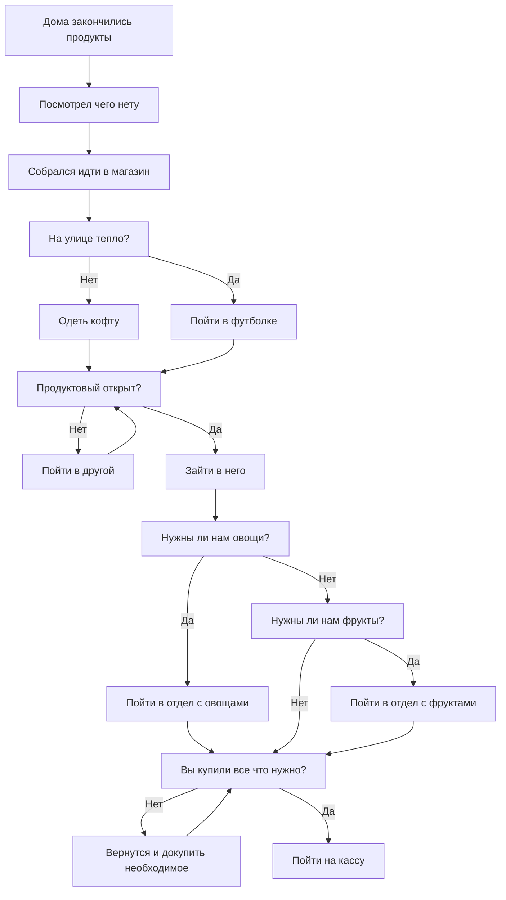
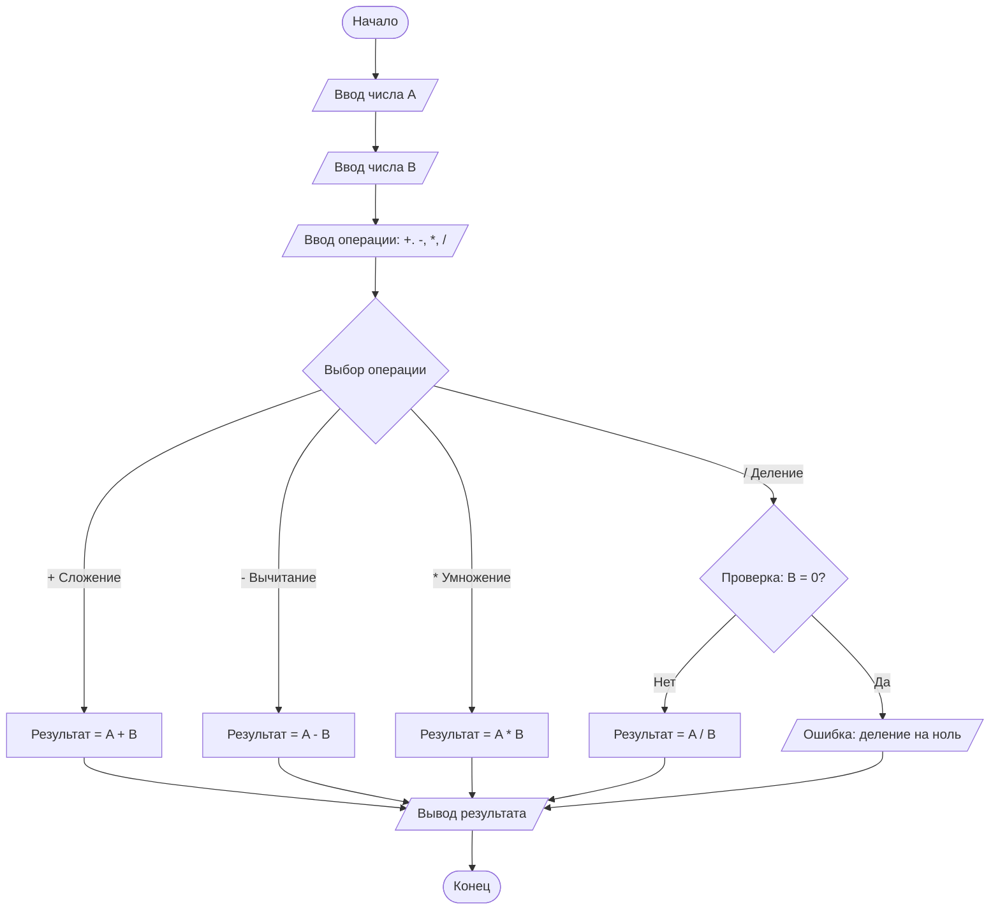
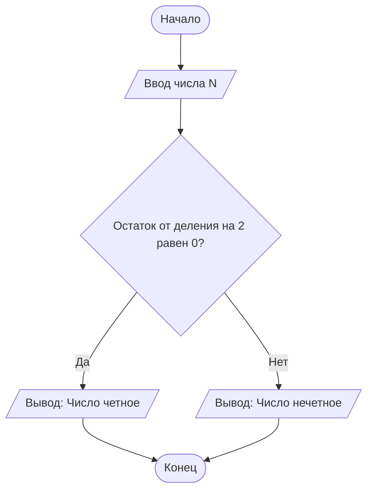

## Составление блок-схем с помощью draw.io / Microsoft visio

**Цель работы:** Вспомнить как создаются Блок-схемы и обрести практические навыки в составлении блок-схем

**Задачи работы:**
1. Изучить теоретический материал
2. Составить блок-схемы по заданию

**Критерии оценки:**
1. Правильность составленных блок-схем
2. Полнота составленных блок-схем
3. Выполнение дополнительного задания

### Теоретическая часть
[[Основные блоки Блок-схем]]

### Практическое часть

#### Задание 1.

Написать Блок-схему "Уборки в доме".

**Условия**: В блок схеме должно быть: 
- не меньше 10 процессов.
- не меньше 5 условий.
- не меньше 1 цикла

#### Задание 2.

Написать Блок-схему "Поход в магазин".

**Условия**: В блок схеме должно быть: 
- не меньше 10 процессов.
- не меньше 5 условий.
- не меньше 1 цикла.
- не меньше 1 блока данных.

#### Задание 3.

Написать Блок-схему "Калькулятор".

**Условия**: Калькулятор должен иметь следующие функции:
- Суммирование
- Вычитание
- Умножение
- Деление

*Примечание*: подумайте над тем, какие блоки можно использовать.

#### Задание 4

Вариативное задание [[LR №1 (Variants)]]
#### Вариант 7
Определить, является ли введенное пользователем число четным или нечетным.

*Пояснение:* Подумайте над тем, почему число является чётным (при каком условии)